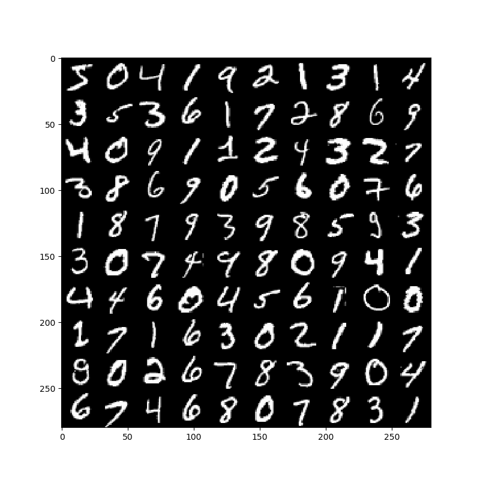
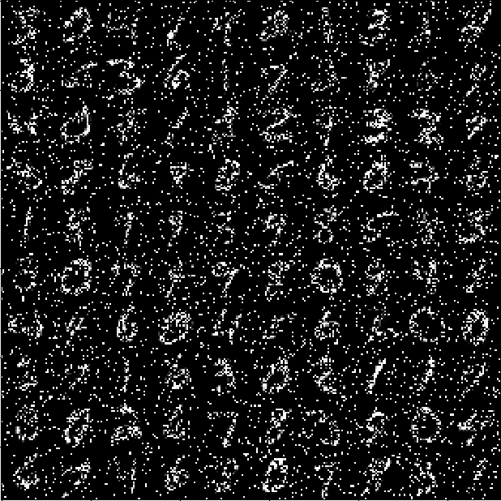
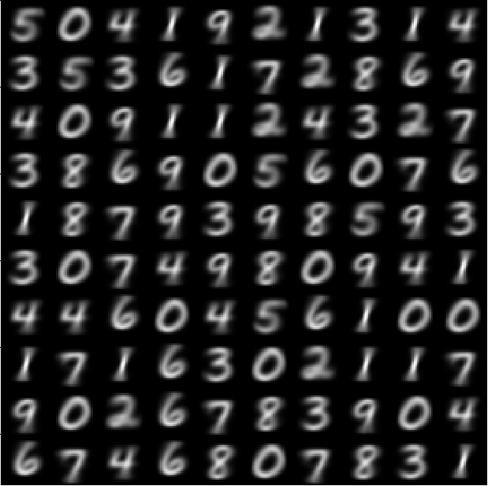

## Conditional Variaional AutoEncoder(CVAE)-Tensorflow

**I Write the Tensorflow code for CVAE(M1)** , M1 is the Latent Discriminative Model


**This code has following features**
1. when we train our model, I use 0.6 dropout rate.
2. All activation functions are leaky relu.
3. I use He_initializer for weights initialization.

## Enviroment
- OS: Ubuntu 16.04

- Graphic Card /RAM : 1080TI /16G

- Python 3.5

- Tensorflow-gpu version:  1.4.0rc2 

- OpenCV 3.4.1

## Schematic of CVAE


## Code

**1. Conditional Gaussian Encoder**
```python
def conditional_gaussian_encoder(self, X, Y, keep_prob):

    with tf.variable_scope("gaussian_encoder", reuse = tf.AUTO_REUSE):
        X_input = tf.concat((X,Y), axis =1)
        net = drop_out(leaky(dense(X_input, self.n_hidden[0], name = "Dense_1")), keep_prob)
        net = drop_out(leaky(dense(net, self.n_hidden[1], name="Dense_2")), keep_prob)
        net = dense(net, self.n_z*2, name ="Dense_3")
        mean = net[:,:self.n_z]
        std = tf.nn.softplus(net[:,self.n_z:]) + 1e-6

    return mean, std
```

**2. Conditional Bernoulli Decoder**
```python
def conditional_bernoulli_decoder(self,Z, Y, keep_prob):

    with tf.variable_scope("bernoulli_decoder", reuse = tf.AUTO_REUSE):
        z_input = tf.concat((Z,Y), axis = 1)
        net = drop_out(leaky(dense(z_input, self.n_hidden[2], name = "Dense_1")), keep_prob)
        net = drop_out(leaky(dense(net, self.n_hidden[3], name="Dense_2")), keep_prob)
        net = tf.nn.sigmoid(dense(net, self.n_out, name = "Dense_3"))
    
    return net
```

**3. Conditional Variational AutoEncoder**
```python
def Conditional_Variational_AutoEncoder(self, X, X_noised, Y, keep_prob):

    X_flatten = tf.reshape(X, [-1, self.n_out])
    X_flatten_noised = tf.reshape(X_noised, [-1, self.n_out])

    mean, std = self.conditional_gaussian_encoder(X_flatten_noised, Y, keep_prob)
    z = mean + std*tf.random_normal(tf.shape(mean, out_type = tf.int32), 0, 1, dtype = tf.float32)

    X_out = self.conditional_bernoulli_decoder(z, Y, keep_prob)
    X_out = tf.clip_by_value(X_out, 1e-8, 1 - 1e-8)

    likelihood = tf.reduce_mean(tf.reduce_sum(X_flatten*tf.log(X_out) + (1 - X_flatten)*tf.log(1 - X_out), 1))
    KL_Div = tf.reduce_mean(0.5 * tf.reduce_sum(1 - tf.log(tf.square(std) + 1e-8)
                                                + tf.square(mean)
                                                + tf.square(std), 1))

    Recon_error = -1*likelihood
    Regul_error = KL_Div

    self.ELBO = Recon_error + Regul_error

    return z, X_out, self.ELBO
```

## Result
**1. Denoising and Restoring**
```
python main.py --add_noise True
```

<table align='center'>
<tr align='center'>
<td> Original Images </td>
<td> Images denoised </td>
<td> Images Restored via CVAE </td>
</tr>
<tr>
<td>
<td>
<td>
</tr>
</table>

**2. Manifold Learning Result**

<table align='center'>
<tr align='center'>
<td> MNIST manifold with a condition of label 1 </td>
<td> MNIST manifold with a condition of label 2 </td>
<td> 2d MNIST manifold </td>
</tr>
<tr>
<td>
<td>
<td>
</tr>
</table>

**3. Conditional Generation**


## Reference Papers
**1. https://arxiv.org/abs/1406.5298**

**2. https://arxiv.org/abs/1312.6114**

**3. https://arxiv.org/abs/1606.05908**

## References

**1.https://github.com/hwalsuklee/tensorflow-mnist-VAE**

**2.https://github.com/hwalsuklee/tensorflow-mnist-CVAE**

**3.https://github.com/MINGUKKANG/VAE-tensorflow**
